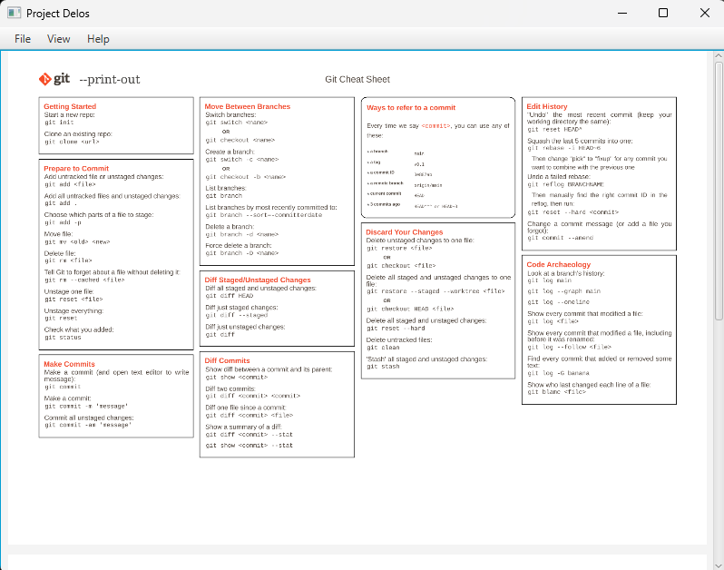

# Project Delos

## Intro
A lightweight, open-source PDF reader built entirely with Java. Designed to bridge the gap between heavy software and simple viewing needs. Reading made simple, code made clear.

## Image Presentation


## Technologies
- Java 21
- JavaFX 13
- Apache PDFBox 3.0.1
- Maven

## Features
- Open and view PDF files.
- Sequential page viewing.
- Responsive page scaling.
- Simple, intuitive navigation menu.

## How I built it
The application was built using JavaFX to construct a clean, responsive frontend (`MainView`, `TopBar`, `AboutView`). In the backend, Apache PDFBox (`PdfService`) is integrated to parse and render PDF pages into images that JavaFX can display. Maven is used to handle dependencies and the build lifecycle.

## What I learned
Through this project, I learned how to integrate JavaFX with third-party libraries like PDFBox, manage file choosers for user input, convert standard Java AWT images to JavaFX images, and structure a modular JavaFX application.

## Future Enhancements
- Implement Zoom In/Out functionality.
- Integrate SQLite for potential data persistence or settings management.
- Improve error handling and user feedback dialogues.

## How to run the project
Make sure you have Java 21 and Maven installed. Then, run the following command in the project root:

```bash
mvn clean javafx:run
```
